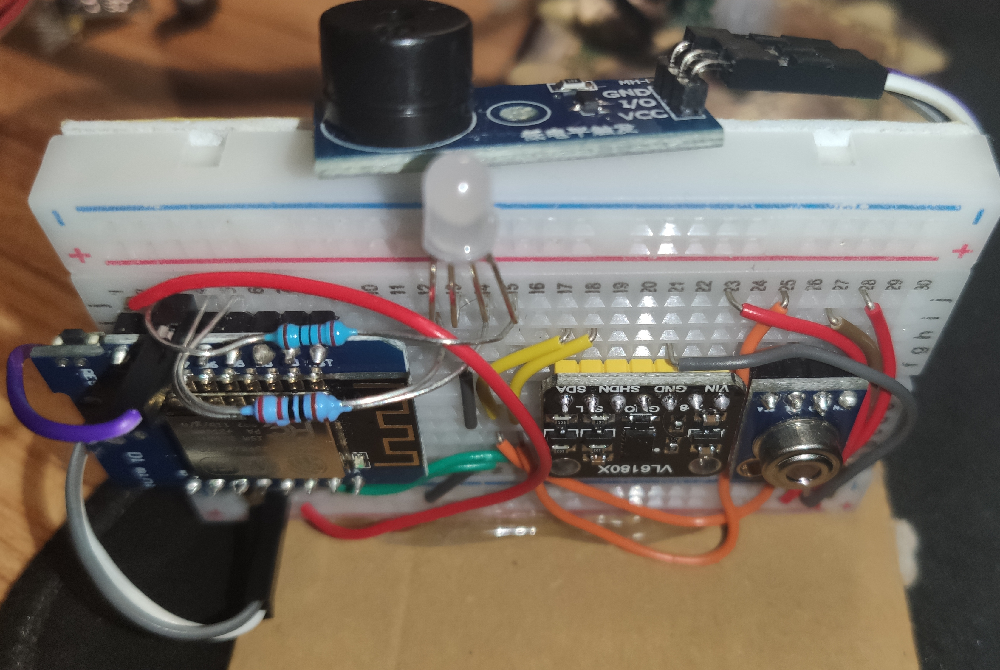
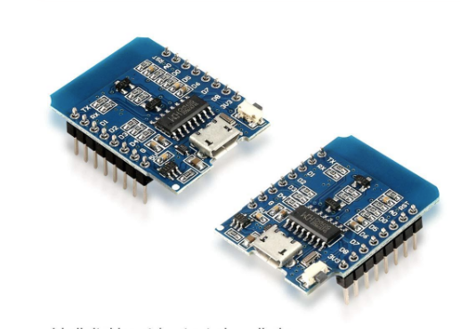
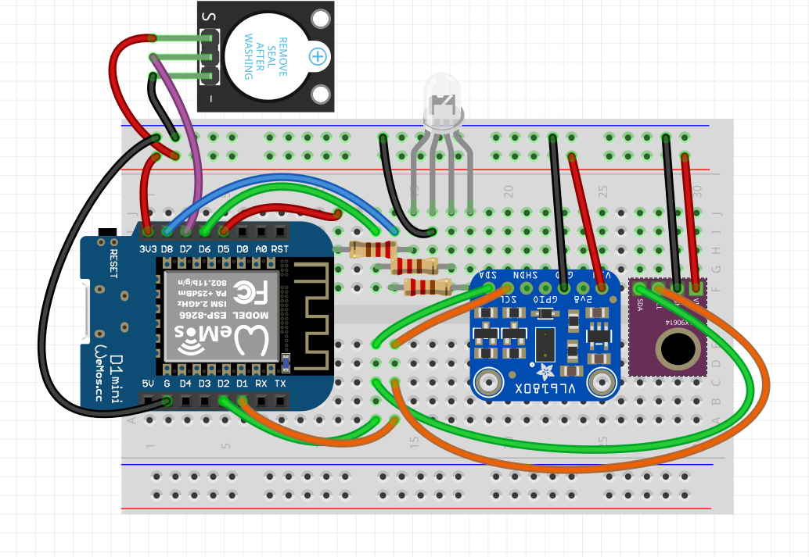
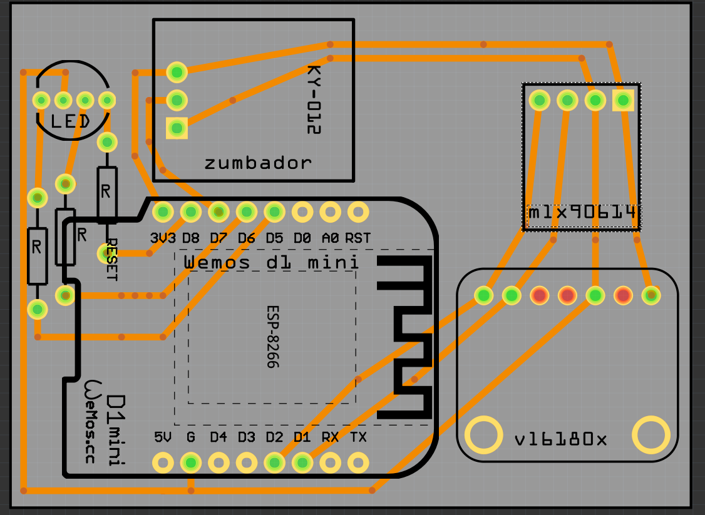
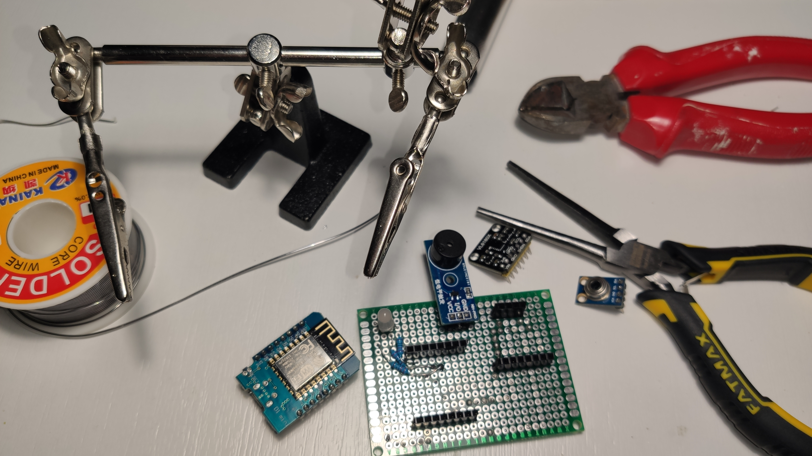
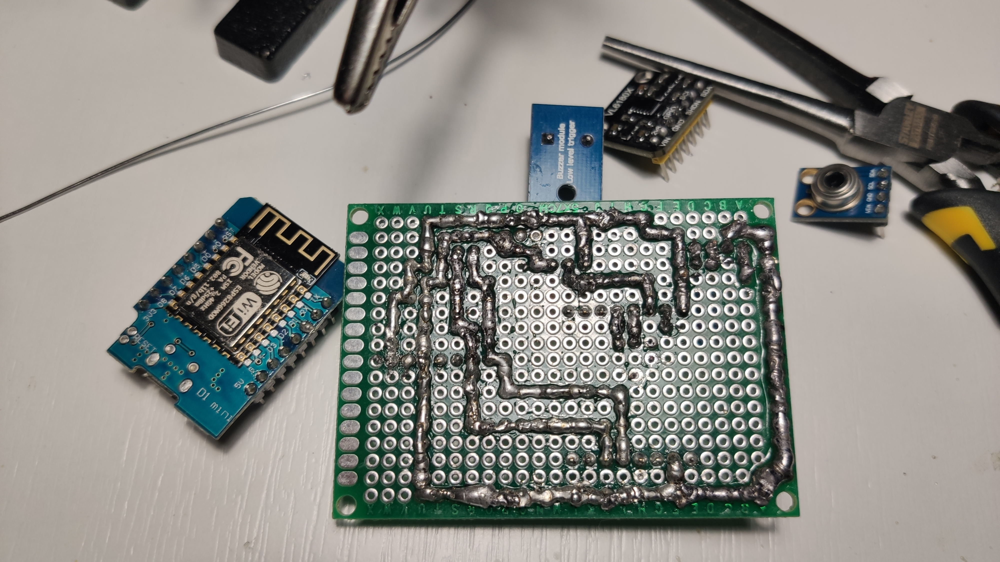
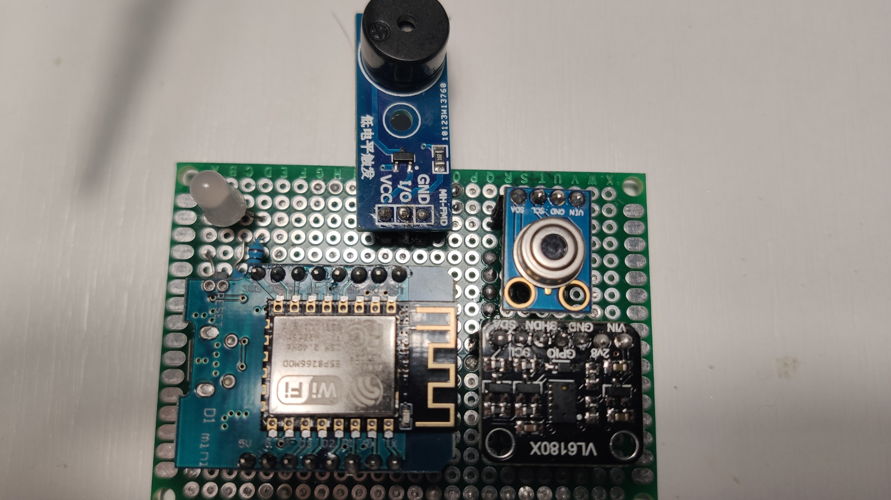

# Avisa-te

Proyecto para avisar que tu té está en la temperatura exacta para tomar. Por defecto está a 54 grados, lo puedes modificar. 

Usando una wemos d1 mini esp6266, junto con varios sensores, con un mínimo de presupuesto y fácil de montar.

 

## Prerrequisitos
Uso platformio, por lo que se debe instalar visual code, plugin platformio. 

## Lista de materiales necesarios

imagen | Componente |  precio (u) | url
------- |------------- |------- | --------
 | 2x wemos d1 mini (esp8266) |  1,63€  | [Aliexpress](https://es.aliexpress.com/item/32958591238.html?spm=a2g0s.9042311.0.0.274263c01DRJqH)
sin imagen | Cables conexión proboard de colores | - | -
sin imagen | Protoboard 400 | - | -
sin imagen | Led rgb | - | -
sin imagen | Vl6180x | - | -
sin imagen | Mlx90614 | - | -
sin imagen | zumbador pasivo | - | -

<!-- ## Lista herramientas necesarias -->

## Esquema circuito en protoboard

 

## Esquema circuito en PCB

 

Así son los resultados:

 
 
 